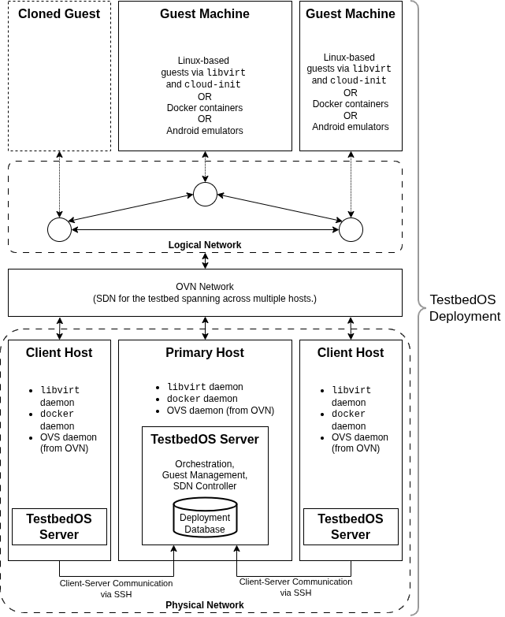

# TestbedOS Configurations and Clustering Mode

TestbedOS provides a clustering mode that ables a deployment to be run across a cluster of multiple TestbedOS hosts, instead of a single TestbedOS host. The objective of the clustering mode is to allow the cluster of hosts to distribute the overhead of running the deployment equally for better performance.
The architecture of a TestbedOS deployment with a cluster of hosts with their [TestbedOS servers](server.md) is visualised in the diagram below.



## TestbedOS Host Configurations

Before the clustering mode can be run, configurations have to be made on the TestbedOS hosts as TestbedOS needs to know the information of the hosts of a deployment, either as a *singleton* host or the *main* host in the clustering mode, or a *client* host in the clustering mode. 

The `host.json` file contains the necessary information for the TestbedOS host(s) and `mode.json` determines how the current host will behave (standalone, main, or client). These files must exist before a deployment can be run. As part of the installation process, the `host.json` file and the `mode.json` file will be created in `/var/lib/testbedos/config/`.

The ``setup.sh`` script, which is executed as part of the [Quick Installation](welcome.md#quick-installation), configures  both of the `host.json` and `mode.json` files for a singleton host and places them in `/var/lib/testbedos/config/` automatically. 

### Singleton Mode or the Main Host

The [Quick Installation](welcome.md#quick-installation) assumes that the current host is a singleton or the main host in a cluster. In this case, the `mode.json` contains the string `"Main"` and an example of the content of the `host.json` file is the following key-value pairs. `"Main"` in `mode.json` means that the current TestbedOS host will also host the TestbedOS server.

```json
{
    "ip": "10.50.0.1",
    "user": "ubuntu",
    "identity_file": "/home/ubuntu/.ssh/id_ed25519",
    "testbed_nic": "eth0",
    "main_interface": "wlo1",
    "is_main_host": true,
    "ovn": {
        "chassis_name": "main",
        "bridge": "br-int",
        "encap_type": "geneve",
        "encap_ip": "10.50.0.1",
        "main_ovn_remote": "unix:/usr/local/var/run/ovn/ovnsb_db.sock",
        "client_ovn_remote": null,
        "bridge_mappings": [
            [
                "public",
                "br-ex",
                "172.16.1.1/24"
            ]
        ]
    }
}
```

These values are generally good defaults you can use on your own machine as a TestbedOS host, with the `user` value being your username and the `identity_file` path being the path where the SSH key for the client-server communication for this host is stored (for more details, see the [Client-Server Communication](server.md#client-server-communication)).

The `ip` value will be the IP address the current host is accessible by other TestbedOS hosts in the cluster, and the `testbed_nic` value is also the interface for this. However, if the current testbed is deployed in the singleton mode or on its own in the clustering mode then both of these values can be `127.0.0.1`. 

The `main_interface` value is the interface that the host uses to provide guests internet access. The example above uses the wireless interface `wlo1` of the current host as a possible interface, e.g., if TestbedOS is installed on a laptop connected to a WiFi.

The `ovn` section of this JSON file is used to configure Open Virtual Network (OVN) settings. 
For a TestbedOS host in the `"Main"` mode, the above example can be used as is as long as it is fine with the NAT IP addresses of guests being in the logical network of the `172.16.1.1/24` subnet.
The `encap_ip` here should usually be the same as the host's IP adress, as this is the IP address OVS uses to create the overlay network with the other TestbedOS hosts in the clustering mode.
If the host is in the `"Client"` mode, `client_ovn_remote` must be set to the IP address of the main host, in this case, `tcp:10.50.0.1:6642`.
You also need to specify the protocol and port to the main host's OVN server, so the `ip` value in this example should be replaced with the IP address of the main host in the cluster.

### Client Host

The above example shows how to set up the standalone host or the main host in a cluster with the TestbedOS server. 

As in the [Clustering Mode documentation](clustering_mode.md), we recommend having the testbed servers of the client hosts communicate via a dedicated LAN that is separate to the main host's internet connection.
Currently, using the same network interface for both the main host's internet connection and OVN or TestbedOS networking is unsupported.

To set up the client hosts, only slight changes are needed for you to make in `host.json`. For example, if the main host has the IP address `10.50.0.1` and the client host that we are currently configuring has the IP address `10.50.0.2`, the changes are as follows.
Note that the `chassis_name` value must be unique for each client host in a cluster.

``` json
{
    "ip": "10.50.0.2",
    "user": "ubuntu",
    "identity_file": "/home/ubuntu/.ssh/id_ed25519",
    "testbed_nic": "eth0",
    "main_interface": "wlo1",
    "is_main_host": true,
    "ovn": {
        "chassis_name": "client1",
        "bridge": "br-int",
        "encap_type": "geneve",
        "encap_ip": "10.50.0.2",
        "main_ovn_remote": "tcp:10.50.0.1:6642",
        "client_ovn_remote": null,
        "bridge_mappings": [
            [
                "public",
                "br-ex",
                "172.16.1.1/24"
            ]
        ]
    }
}
```

Once this is done, you can then run the following command to add the client host to the main host.

``` bash
sudo testbedos-server client -m 10.50.0.1 -t eth0
```

The contents of the `mode.json` file for a client host operating in the `"Client"` mode requires two options.
This file can be manually created or will be made by the `testbedos-server` binary from the above command when running in client mode with these two arguments.

``` json
{
    "Client": {
        "main_ip": "10.50.0.1",
        "testbed_interface": "eth0"
    }
}
```

Then you can check with OVN on the main host with the following command to see if the client `chassis_name` appear in the list of chassis in the output.

``` bash
sudo ovn-sbctl show
```

### Main Host Server Configurations

The server on the `Main` TestbedOS host will has an additional configuration file `kvm-compose-config.json`. The `kvm-compose-config.json` configuration file keeps track of the information of other `Client` TestbedOS hosts in a cluster. The file also specifies the SSH keys that are used to SSH into the guest machines to interact with the guest machines for the [`kvm-compose` commands](user_interface_kvm_compose.md). An example of the contents of a `kvm-compose-config.json` is as follows.

``` json
{
    "testbed_host_ssh_config": {
        "main": {
            "ip": "10.50.0.1",
            "user": "wil",
            "identity_file": "/home/wil/.ssh/id_ed25519",
            "testbed_nic": "eth0",
            "main_interface": "wlp0s20f3",
            "is_main_host": true,
            "ovn": {
                "chassis_name": "main",
                "bridge": "br-int",
                "encap_type": "geneve",
                "encap_ip": "10.50.0.1",
                "main_ovn_remote": "unix:/usr/local/var/run/ovn/ovnsb_db.sock",
                "client_ovn_remote": null,
                "bridge_mappings": [
                    [
                        "public",
                        "br-ex",
                        "172.16.1.1/24"
                    ]
                ]
            }
        }
    },
    "ssh_public_key_location": "/var/lib/testbedos//keys/id_ed25519_testbed_insecure_key.pub",
    "ssh_private_key_location": "/var/lib/testbedos//keys/id_ed25519_testbed_insecure_key"
}
```

## Starting the TestbedOS Cluster

Before starting a TestbedOS cluster, please ensure that all hosts in the cluster must be accessible i.e. on the same local network and you will also need to have individually configured each host's `host.json` as in [the previous section](#testbedos-host-configurations).
We recommend having the servers of the client TestbedOS hosts to communicate via a dedicated LAN that is separate to the `"Main"` TestbedOS host's internet connection.
Currently, using the same network interface for both the `"Main"` host's internet connection and OVN or TestbedOS networking is unsupported.


To start running a cluster, you will first have to start the client TestbedOS hosts in the cluster by running the server of the client hosts with either of the following commands:

- `sudo /usr/local/bin/testbedos-server client -m <ip of main testbed host> -t <interface visible to main host on local network>`
- `sudo -E bash -c  'cargo run -- client -m <ip of main testbed host> -t <interface visible to main host on local network>' $USER`
- If you are using the `systemctl` method of running the TestbedOS server, i.e., `sudo systemctl start testbedos-server`, you must make sure the `mode.json` of the client TestbedOS in `/var/lib/testbedos/config/` has already been configured with the client configuration.

Similar to the `"Main"` TestbedOS host, once you have successfully run the server on the client host, you do not have to specify the client host with arguments as this will be read from the `mode.json`.
Please see [the TestbedOS server's cluster management](server_architecture.md#cluster-management) for more information.
