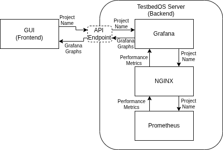

# TestbedOS Resource Monitoring

TestbedOS offers resource monitoring for the TestbedOS hosts that are part of [a cluster](clustering_mode.md) and for the guests in a deployment.
We provide dashboards available via [the GUI](user_interface.md#gui) at `localhost:3355/gui/` for the `"Main"` TestbedOS host. 
Under the 'Resource Monitoring' tab, you can view the list of the names of the deployments to monitor its resources.

As an overview, the resource monitoring stack consists of the following:
1. NGINX as a proxy server,
2. Prometheus as the time series database, and
3. Grafana for the data visualisation.

## Architecture

TestbedOS resource monitoring is split into a frontend and a backend.

### Frontend

[The TestbedOS server](server.md) provides a resource monitoring dashboard endpoint `/api/metrics/dashboard/<project name>` as part of [its list of API offered](server_api.md). 

The API endpoint takes in a the `<project name>`, which is the name of the TestbedOS project for the deployment.
The API endpoint checks [the state configuration file `state.json` of the deployment](orchestration.md#state-configuration-file) and gets the names of the TestbedOS hosts and guests that make up the deployment. 

Once the TestbedOS hosts in the cluster and guests for the deployment has been identified, the Prometheus API endpoints, also offered by the TestbedOS server, are called to collect the performance metrics.
Please see [TestbedOS server API](server_api.md) for a more complete list of this.

An HTML page is then rendered that contains the graphs visualised by Grafana based on the performance metrics data.
Each Grafana graph is then embedded in an iframe to be displayed on the HTML page.

### Backend

The TestbedOS resource monitoring stack consists of Grafana, Prometheus, and NGINX. 
The stack is deployed through docker-compose and it has been set to `restart` automatically `unless-stopped` in `docker-compose.yaml`.

NGINX is used as a reverse proxy to group the Grafana HTTP endpoint and the GUI URL as a single 'origin'.
This is because the localhost URLs on the TestbedOS hosts are using different ports, and we run into Cross Origin Resource Sharing (CORS) problems.
So to avoid changing TestbedOS user's browser settings to reduce security, we put everything under a reverse proxy.

[The TestbedOS server](server.md) provides API endpoints for Prometheus to scrape metrics, grouped under hosts or guests.
In these endpoints, the TestbedOS server on the `"Main"` TestbedOS host will collect the metrics on the active TestbedOS hosts in the cluster, then the guests in all active deployments.
Please refer to [the clustering mode](clustering_mode.md) to learn more about the roles of the hosts in a cluster

In every cluster, both `"Main"` and client TestbedOS hosts have endpoints that provide the performance metrics for itself and the guests for the deployments each of them is running.
The `"Main"` host will work out where everything is, based on [the state configuration file](orchestration.md#state-configuration-file) for each active deployment and call the endpoint of the respective TestbedOS host.
Prometheus will scrape the `"Main"` TestbedOS host's metrics endpoint periodically (every 5 seconds) to collect the metrics for every eligible host or guest.
The metric scraping endpoint is only enabled on the TestbedOS server when in main mode, i.e., on the `"Main"` TestbedOS host.

To get performance metrics such as CPU time, we need to sample the CPU time twice.
Given we have a limit of 5s between each Prometheus scraping, we are just sampling between 0.5s on each endpoint request.
While this can be tuned, we need to consider the time it takes for the `"Main"` TestbedOS host to poll every host in every cluster for each guest.
Therefore the tuning must consider how this scales as we add more hosts and more guests to the cluster.

To get the performance metrics data for the different types of guest machines:
- For libvirt guests, a connection to the libvirt daemon is made to solicit for the performance metrics data.
- For Docker container guests, we look directly at the filesystem under `/sys/fs/cgroup/system.slice/docker-<container id>.scope/` for live metrics.
Docker offers a `stats` endpoint, but this uses a 1 second sample rate.
Rather than connecting to the Unix socket over and over for this, we have opted to directly inspect the files as
this means we are at least consistent in the sampling rate of all guest types.
- For AVD guests, we are yet to implement this feature.
